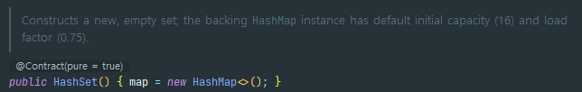
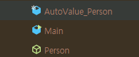

# equals를 재정의하려거든 hashcode도 재정의하라

## ✅`equals`와 `hashcode` 사용해보기

### Case1) `equals`를 재정의 하지 않았을 경우

`Object`의 `equals`를 사용하기 때문에 주소값을 비교하여 항상 `다르다`라는 결과가 반환된다.

```java
public class Device {

    private final int id;
    private final String name;
    private final String networkIp;

    public Device(final int id, final String name, final String networkIp) {
        this.id = id;
        this.name = name;
        this.networkIp = networkIp;
    }
}
```

```java
public static void main(String[] args) {
        Device device_1 = new Device(1, "Device_name_1", "networkIp1");
        Device device_2 = new Device(1, "Device_name_2", "networkIp2");
        System.out.println("result1 = " + (device_1 == device_2)); // false
        System.out.println("result2 = " + (device_1.equals(device_2))); // false
    }
```


### Case2) `equals`만 재정의하였을 경우

- `논리적` 동치성에 의해 `equals`를 사용하면 그 둘은 같은 객체로 판단한다.
- `해시 구조`를 사용하면 `컬렉션`에서는 그 둘을 다른 객체로 판단한다.

```java
public class Device {

    private final int id;
    private final String name;
    private final String networkIp;

    public Device(final int id, final String name, final String networkIp) {
        this.id = id;
        this.name = name;
        this.networkIp = networkIp;
    }

    @Override
    public boolean equals(final Object o) {
        if (this == o) return true;
        if (o == null || getClass() != o.getClass()) return false;
        Device device = (Device) o;
        return id == device.id;
    }
}
```

```java
public static void main(String[] args) {
        Device device_1 = new Device(1, "Device_name_1", "networkIp1");
        Device device_2 = new Device(1, "Device_name_2", "networkIp2");
        System.out.println("result = " + (device_1.equals(device_2))); // true

        HashSet<Device> deviceHashSet = new HashSet<>();
        deviceHashSet.add(device_1);
        deviceHashSet.add(device_2);
        System.out.println("deviceHashSet.size() = " + deviceHashSet.size()); // 2
    }
```


### Case3) `hashcode`만 재정의했을 경우

- `hashcode`가 같더라도 버킷 안에서 `equals`비교 시 다른 객체로 판단한다.

```java
public class Device {

    private final int id;
    private final String name;
    private final String networkIp;

    public Device(final int id, final String name, final String networkIp) {
        this.id = id;
        this.name = name;
        this.networkIp = networkIp;
    }
    
    @Override
    public int hashCode() {
        return Objects.hash(id);
    }
}
```

```java
public class Main {
    public static void main(String[] args) {
        Device device_1 = new Device(1, "Device_name_1", "networkIp1");
        Device device_2 = new Device(1, "Device_name_2", "networkIp2");
        System.out.println("result = " + (device_1.equals(device_2))); // false

        HashSet<Device> deviceHashSet = new HashSet<>();
        deviceHashSet.add(device_1);
        deviceHashSet.add(device_2);
        System.out.println("deviceHashSet.size() = " + deviceHashSet.size()); // 2
    }
}
```


### Case4) `equals`와 `hashcode`를 둘다 재정의했을 경우

- 객체의 비교와 해시 기반의 비교에서도 모두 올바르게 동작

```java
public class Device {

    private final int id;
    private final String name;
    private final String networkIp;

    public Device(final int id, final String name, final String networkIp) {
        this.id = id;
        this.name = name;
        this.networkIp = networkIp;
    }

    @Override
    public boolean equals(final Object o) {
        if (this == o) return true;
        if (o == null || getClass() != o.getClass()) return false;
        Device device = (Device) o;
        return id == device.id;
    }

    @Override
    public int hashCode() {
        return Objects.hash(id);
    }
}
```

```java
public static void main(String[] args) {
        Device device_1 = new Device(1, "Device_name_1", "networkIp1");
        Device device_2 = new Device(1, "Device_name_2", "networkIp2");
        System.out.println("result = " + (device_1.equals(device_2))); // true

        HashSet<Device> deviceHashSet = new HashSet<>();
        deviceHashSet.add(device_1);
        deviceHashSet.add(device_2);
        System.out.println("deviceHashSet.size() = " + deviceHashSet.size()); // 1
    }
```


## 🔑 2. **hashcode?**

가장 대표적인 사용처는 다음과 같은 **해시 구조를 사용하는 컬렉션 클래스들**이다:

- `HashMap`
- `HashSet`
- `Hashtable`
- `LinkedHashMap` / `LinkedHashSet`

이 컬렉션들은 내부적으로 객체를 **배열 인덱스로 매핑**하기 위해 `hashCode()`를 사용한다.
 즉, 객체를 저장하거나 검색할 때 `hashCode()` 값을 바탕으로 어느 버킷(bucket)에 위치할지를 결정한다.

> 잠깐!!! 버킷이란?
>
> **해시 기반 자료구조(`HashMap`, `HashSet` 등)에서, 데이터를 저장하는 공간의 "슬롯" 또는 "그룹"**
>
> - 해시 함수를 통해 나온 `hashCode()` 값을 바탕으로 **어느 버킷에 저장할지를 결정**한다.
>
> - **"해시코드 % 버킷 수 = 인덱스"**
>
> - 내부 구조
>
>   ```
>   [ 버킷 0 ] → LinkedList<Node>
>   [ 버킷 1 ] → LinkedList<Node>
>   [ 버킷 2 ] → LinkedList<Node>
>   ...
>   [ 버킷 n ] → LinkedList<Node>
>   ```
>
>   ※ 자바 8이후로는 최적화를 위해 `Tree`로도 변환됨
>
>   > 잠깐의 잠깐!!! 버킷 수?
>   >
>   > | 항목                    | 기본값 |
>   > | ----------------------- | ------ |
>   > | 초기 버킷 수 (capacity) | 16     |
>   > | 로드 팩터 (load factor) | 0.75   |
>   >
>   > 즉, **16개의 버킷**을 갖고 시작하고,
>   >  **배열이 75% 찼을 때(= 12개 이상 들어오면)** 자동으로 **크기를 2배 늘림**
>   >  → **리사이즈(resize)** 발생!
>   > 

###   🧩**객체 비교 최적화**

`equals()`를 비교하기 전에 `hashCode()`를 먼저 비교하여, **성능을 최적화**한다.

- 만약 두 객체의 `hashCode()` 값이 다르면, `equals()`는 검사할 필요 없이 `false`라고 간주된다.
- 같을 경우에만 `equals()`를 호출하여 진짜 동일한지 확인한다.


### 💥 만약 충돌이 발생한다면?

### → `equals()`를 사용해서 실제 동등한지 비교**

- `hashCode()`가 같을 경우에는 충돌이 일어난 것일 수 있으니까,
- **동등한 객체인지 판단하려면 반드시 `equals()`로 확인**한다.

### 예제)

```java
class Person {
    String name;

    Person(String name) {
        this.name = name;
    }

    @Override
    public int hashCode() {
        return 42; // 일부러 충돌을 유도 😈
    }

    @Override
    public boolean equals(Object obj) {
        if (this == obj) return true;
        if (!(obj instanceof Person)) return false;
        Person p = (Person) obj;
        return name.equals(p.name);
    }
}
```

```java
public static void main(String[] args) {
        HashSet<Person> set = new HashSet<>();
        set.add(new Person("Alice"));
        set.add(new Person("Bob"));
        System.out.println("set.size() = " + set.size()); // 2
    }
```


## 해시코드 계산

- 책 예시를 통한 해시 코드
- `31` 소수를 활용하여 해시코드를 계산한다.

```java
@Override
    public int hashCode() {
        int result = Short.hashCode(areaCode);
        result = result * 31 + Short.hashCode(prefix);
        result = result * 31 + Short.hashCode(lineNum);
        return result;
    }
```

> 31과 같은 소수를 사용하는 이유?
>
> 1. 성능
>    31은 `x<<5 - x`처럼 시프트와 뺄샘을 통해 빠르게 계산을 해낼 수 있다.
> 2. 해시 코드의 분포
>    `짝수`나 `홀수`에서는 같은 숫자의 분포가 나올 확률이 높아 충돌 가능성이 높다.
> 3. 적당히 큰 수
>    `7`과 같은 수는 너무 작은 소수이기 때문에 해시 코드의 분포가 좁아서 충돌 가능성이 높다. 하지만, `31`은 적당히 큰 수를 가지고 있기 때문에 넓은 분포를 가질 수 있다.

`Objects`의 hashCode는 아래와 같이 나타나있다.
배열로 입력을 받고, 기본형의 경우 `박싱`과 `언박싱`도 거쳐야 해서 느리다.(책의 주장)

```java
public static int hashCode(Object[] a) {
        if (a == null)
            return 0;

        int result = 1;

        for (Object element : a)
            result = 31 * result + (element == null ? 0 : element.hashCode());

        return result;
    }
```

- 아래와 같이 테스트를 진행
  - 5회 테스트 진행했을 때 `Objects`보다 4배 빠르다.(158000ns → 40100ns)

```java
@Override
    public int hashCode() {
        long startNum = System.nanoTime();
//        int result = Short.hashCode(areaCode);
//        result = result * 31 + Short.hashCode(prefix);
//        result = result * 31 + Short.hashCode(lineNum);
        int result = Objects.hash(areaCode, prefix, lineNum);
        long endNum = System.nanoTime();
        System.out.println("time: " + (endNum - startNum));
        return result;
    }
```


### 해시 코드의 캐싱

객체가 불변이며 해시 코드가 자주 사용될 가능성이 있을 경우, 캐시를 사용하면 성능을 높일 수 있다.
즉, `HashSet`과 `HashMap`에 자주 검색되거나, 객체의 속성이 많은 경우에 사용하면 좋다.

```java
public class Immutable {
    
    private final short areaCode, prefix, lineNum;
    private final int hashCode;

    public Immutable(final short areaCode, final short prefix, final short lineNum) {
        this.areaCode = areaCode;
        this.prefix = prefix;
        this.lineNum = lineNum;
        this.hashCode = computeHashCode();
    }

    private int computeHashCode() {
        int result = Short.hashCode(areaCode);
        result = result * 31 + Short.hashCode(prefix);
        result = result * 31 + Short.hashCode(lineNum);
        return result;
    }

    @Override
    public boolean equals(final Object o) {
        if (this == o) return true;
        if (o == null || getClass() != o.getClass()) return false;
        Immutable immutable = (Immutable) o;
        return areaCode == immutable.areaCode && prefix == immutable.prefix && lineNum == immutable.lineNum;
    }

    @Override
    public int hashCode() {
        return hashCode;
    }
}
```


## `AutoValue` 사용해보기

- `@AutoValue`를 사용하면 `hashCode()`, `equals()`, `toString()`을 자동 생성한다.
  → 개인적으로 `class`를 `abstract`로 만들어야해서 불편함이 큰 것 같다.

```java
@AutoValue
public abstract class Person {
    public abstract String name();
    public abstract int age();

    public static Person create(String name, int age) {
        return new AutoValue_Person(name, age);
    }
}
```



```java
package org.example;

final class AutoValue_Person extends Person {
    private final String name;
    private final int age;

    AutoValue_Person(String name, int age) {
        if (name == null) {
            throw new NullPointerException("Null name");
        } else {
            this.name = name;
            this.age = age;
        }
    }

    public String name() {
        return this.name;
    }

    public int age() {
        return this.age;
    }

    public String toString() {
        return "Person{name=" + this.name + ", age=" + this.age + "}";
    }

    public boolean equals(Object o) {
        if (o == this) {
            return true;
        } else if (!(o instanceof Person)) {
            return false;
        } else {
            Person that = (Person)o;
            return this.name.equals(that.name()) && this.age == that.age();
        }
    }

    public int hashCode() {
        int h$ = 1;
        h$ *= 1000003;
        h$ ^= this.name.hashCode();
        h$ *= 1000003;
        h$ ^= this.age;
        return h$;
    }
}

```

