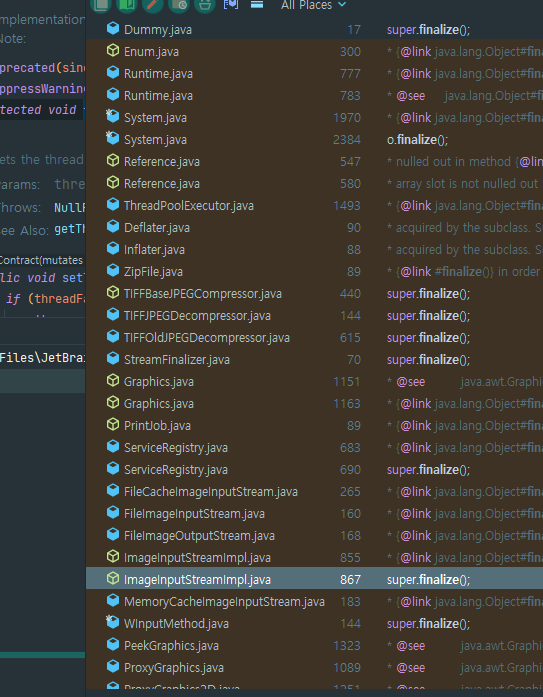

# finalizer와 cleaner 사용을 피하라

## finalizer란?

자바에서 객체가 `Grabage Collection`에 의해 수집되기 직전에 호출되는 메서드이다. `Object` 클래스에 정의되어 있으며, 객체가 소멸될 때 자원을 해제하거나, 종료 작업을 처리하는데 사용된다.

> JDK 1.9부터 Deprecated되었다.

```java
//Object 내부 메서드에 finalize가 존재
@Deprecated(since="9", forRemoval=true)
protected void finalize() throws Throwable { }
```


## `finalize()` 메서드 동작

`finalize()`메서드는 개체가 GC에 의해 수거되기 전에 자동으로 호출된다.

- 자식 클래스에서 `finalize()`를 `Override`하여 사용할 수 있다.

사용 예시)

```java
public class Dummy {
    // 자원 초기화 예시
    private String resource;

    public Dummy(final String resource) {
        this.resource = resource;
        System.out.println("Dummy 객체 생성");
    }

    @Override
    protected void finalize() throws Throwable {
        try {
            // 객체가 GC에 의해 수집될 때 자원을 정리하는 코드
            System.out.println("GC에 의해 수집됩니다. 자원 정리 중...");
            resource = null;
        } finally {
            super.finalize();
        }
    }
}
```

```java
public static void main(String[] args) {
        Dummy dummy = new Dummy("파일");

        // 객체를 null로 설정하여 GC가 이 객체를 수집하도록 유도
        dummy = null;

        System.gc();

        try {
            Thread.sleep(5000);
        } catch (InterruptedException e) {
            e.printStackTrace();
        }
    }
```

```
---콘솔창---
Dummy 객체 생성
GC에 의해 수집됩니다. 자원 정리 중...
```


## `finalize()` 단점

1. 불확실성
   - GC가 언제 발생할지 알 수 없으며, `finalize()`가 호출되지 않을 수도 있다. 즉, 객체가 언제 메모리에서 제거될지 예측할 수 없다.
2. 성능 문제
   - 객체가 GC 대상이 되기 전에 `finalize()` 메서드가 호출되면, 해당 객체는 두 번 GC가 일어나야 한다. 첫 번째는 `finalize()` 메서드가 호출되기 위한 준비 작업, 두 번째는 실제로 객체를 메모리에서 제거하는 작업이다.
3. 예외 처리
   - `finalize()`에서 예외가 발생하면, 예외가 **무시되고** GC가 계속해서 진행된다.
   - 스택 추적이 불가능하며, 객체가 비정상적으로 종료될 여지가 있다.
4. 보안 문제
   - `시크릿 키` 관리 객체를 메모리에 들고 있고 처리 지연이 늦거나 안될 경우 접근이 가능하다.
   - `중요한 파일`이 삭제되지 않은 채 종료되거나 열려있을 수 있다.


## 현업 예시

1. `open`된 파일 회수
   - `finalize`가 언제 수행될지 몰라 계속해서 대기 상태에 있을 수 있다. 파일을 여는 개수는 한계가 있기 때문에 추후에 문제가 발생할 수 있다.
2. 그래픽스 객체 회수
   - `finalize`는 기본적으로 스레드의 우선 순위가 낮다. 그래서 대기열에 수 천개의 객체가 쌓여 있었고 `OutOfMemoryError`가 발생했다.




## `System.gc()`와 `System.runFinalization()`을 사용한다면?

- `System.gc()`: 가비지 컬렉션을 강제로 요청할 수 있지만, 반드시 실행된다는 보장이 없다. `JVM`이 요청을 받지만 이를 무시할 수 있다.
- `System.runFinalization()`: `finalize()` 메서드를 강제로 실행할 수 있지만, 이 역시도 `JVM`이 `finalize()`를 실행할 때까지 기다려야하는 비동기적인 작업이다.

## `Cleaner` 클래스

`Cleaner`는 Java9부터 제공되는 새로운 자원 해제 방법이다. 참조가 더 이상 사용되지 않을 때 자동으로 자원을 정리하는 방식으로, `finalize()`보다 더 안전하고 효율적으로 처리한다.

- `Cleaner`는 GC와 관계없이 등록된 작업을 즉시 시행할 수 있다.
- 멀티스레드 환경에서도 충돌이 발생하지 않게 동기화 처리가 내장되어 있다.
- 자원 해제 과정에서 예외가 발생하면, 이 예외에 대해 적절한 처리를 할 수 있다.

```java
public class Room implements Closeable {
    // 객체 등록
    private static final Cleaner cleaner = Cleaner.create();

    private static class State implements Runnable {
        int numJunkPiles; //방(Room)안의 쓰레기 수, 실제로는 네이티브 피어를 가리키는 포인터여야 한다.

        State(final int numJunkPiles) {
            this.numJunkPiles = numJunkPiles;
        }

        @Override
        public void run() {
            System.out.println("방 청소");
            numJunkPiles = 0;
        }
    }

    // 방의 상태. cleanable과 공유한다.
    private final State state;

    // cleanable 객체. 수거 대상이 되면 방을 청소한다.
    private final Cleaner.Cleanable cleanable;

    public Room(int numJunkPiles) {
        this.state = new State(numJunkPiles);
        this.cleanable = cleaner.register(this, state);
    }

    @Override
    public void close() throws IOException {
        cleanable.clean();
    }
}
```

- `try-with-resources`를 사용하면 사용 후 즉시 `close`처리가 된다.

  ```java
   public static void main(String[] args) {
          
          try(Room room = new Room(10)) {
              Thread.sleep(5000);
          } catch (InterruptedException e) {
              e.printStackTrace();
          }
      }
  ```

- `cleaner`의 경우 언제 `close`될지 알 수 없다.

  ```java
  public static void main(String[] args) {
          new Room(10);
          try {
              Thread.sleep(5000);
          } catch (InterruptedException e) {
              e.printStackTrace();
          }
      }
  ```

  ```java
  // 엄청난 객체 할당으로 충격을 주니 cleaner가 실행되었다.
  public static void main(String[] args) {
          Room room = new Room(10);
          try {
              for (int i = 0; i < 2000000000; i++) {
                  new Virus("ddd");
                  new Virus("ddd");
                  new Virus("ddd");
                  new Virus("ddd");
                  new Virus("ddd");
                  new Virus("ddd");
                  new Virus("ddd");
                  new Virus("ddd");
                  new Virus("ddd");
                  new Virus("ddd");
                  new Virus("ddd");
                  new Virus("ddd");
                  new Virus("ddd");
              }
              Thread.sleep(5000);
          } catch (InterruptedException e) {
              e.printStackTrace();
          }
      }
  ```


## 그러면 `finalize`와 `cleaner`의 활용은?

1. 안전망 역할

   - 객체가 자원을 명시적으로 해제하지 않았을 때, `finalize()`에서 자원을 해제하는 용도로 사용할 수 있다.

   ```java
   public class FileResource {
       private RandomAccessFile file;
   
       public FileResource(String fileName) throws IOException {
           this.file = new RandomAccessFile(fileName, "rw");
       }
   
       // 파일에 데이터를 쓰는 메서드
       public void writeData(String data) throws IOException {
           file.writeUTF(data);
       }
   
       // finalize()가 안정망 역할을 수행하여 자원을 해제
       @Override
       protected void finalize() throws Throwable {
           try {
               if (file != null) {
                   System.out.println("finalize() 호출: 파일을 닫습니다.");
                   file.close();
               }
           } finally {
               super.finalize();
           }
       }
   }
   ```

2. 네이티브 피어 객체 해제
   네이티브 리소스(예: C/C++ 라이브러리)는 `JVM`이 관리하지 않기 때문에 , 자원을 명시적으로 해제해야 한다.

```java
public class NativeResource {

    private long nativeHandle;

    // 네이티브 메서드 - 실제 네이티브 라이브러리에서 리소스를 할당
    public native long allocateNativeResource();

    // 네이티브 메서드 - 실제 네이티브 라이브러리에서 리소스를 해제
    public native void releaseNativeResource(long handle);

    public NativeResource(final long nativeHandle) {
        this.nativeHandle = nativeHandle;
    }

    @Override
    protected void finalize() throws Throwable {
        try {
            if (nativeHandle != 0) {
                System.out.println("finalize() 호출: 네이티브 리소스를 해제합니다.");
                releaseNativeResource(nativeHandle);
            }
        } finally {
            super.finalize();
        }
    }
}

```


## ✅ 오늘의 결론!!

## `try-with-resources`를 사용해서 명시적으로 자원을 해제하자!!!