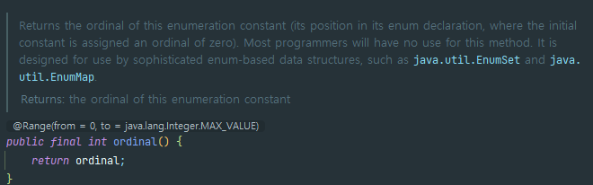
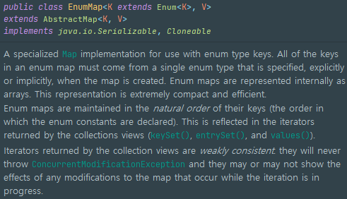

# ordinal 메서드 대신 인스턴스 필드를 사용하라

### ✅ `ordinal`란?

- 대부분의 열거 타입 상수는 하나의 정숫값에 대응된다.
- 모든 열거 타입은 해당 상수가 몇 번재 위치인지 반환하는 `ordinal` 메서드를 제공한다.

예시) `ordinal`의 사용
```java
// ordinal을 잘못 사용한 예 - 따라하지 말 것!!!

public enum Ensemble {
    SOLO, DUET, TRIO, QUARTET, QUINTET,
    SEXTET, SEPTET, OCTET, NONET, DECTET;
    
    public int numberOfMusicians() {
        return ordinal() + 1;
    }
}

```

### 🔥 단점

1. 상수 선언 순서를 바꾸는 순간 `numberOfMusicians`는 오동작한다.
   - `SOLO`와 `DUET`을 바꾸면 `ordinal`값이 변한다.
2. 이미 사용 중인 정수와 값이 같은 상수는 추가할 수 없다.
   - `1`의 값을 가지는 상수를 중복으로 추가할 수 없다.
3. 값을 중간에 비워둘 수 없다.
   - `12명`이 연주하는 3중 4중주를 추가하려고 할 때, `11명`으로 구성된 더미 연주 이름을 추가해야만 한다.

### 🚀 해결책!!! ordinal 메서드 대신 인스턴스 필드에 정수값을 지정하여 사용하자

- 필드에 정숫값을 지정하도록 하면 위 단점들을 모두 해결할 수 있다.

```java
public enum Ensemble {
    SOLO(1), DUET(2), TRIO(3), QUARTET(4), QUINTET(5),
    SEXTET(6), SEPTET(7), OCTET(8), NONET(9), DECTET(10), TRIPLE_QUARTET(12),
    DUPLICATESOLO(1);

    private final int numberOfmusicians;

    Ensemble(final int numberOfmusicians) {
        this.numberOfmusicians = numberOfmusicians;
    }
    
    public int getNumberOfmusicians() {return numberOfmusicians}
}
```

- `Enum`의 API 문서를 보면 `ordinal`은 사용하지 않도록 명시되어 있다. 해당 메서드는 `EnumSet`과 `EnumMap` 같이 열거 타입 기반의 범용 자료구조에 쓸 목적으로 설계되었다. (빠른 조회와 메모리 절약)



- `EnumSet`은 비트 마스크 인덱스로 `ordinal`을 사용한다.
  

- `EnumMap`은 배열 인덱스로 `ordinal`을 사용한다.
  

### 💥 `@Entity`를 설계할 때 `EnumType.ORDINAL`을 사용하지 말자.

- 기본 설정은 `EnumType.ORDINAL`이므로 반드시 `EnumType.STRING`으로 변경하여 사용하도록 하자. 그렇지 않을 경우 위 단점을 그대로 가지고 가게 된다.

```java
@Entity
public class Task {
    @Id
    @GeneratedValue
    private Long id;

    private String title;

    @Enumerated(EnumType.ORDINAL)
    private Status status;

    // getters/setters
}

public enum Status {
    NEW, IN_PROGRESS, COMPLETED
}
```

