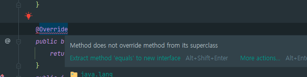

# Override 애너테이션을 일관되게 사용하라

## 📋 @Override 애너테이션

부모 클래스나 인터페이스의 메서드를 재정의할 때 사용하는 애너테이션.
컴파일러가 오버라이딩이 제대로 되었는지 검사한다.

잘못 사용된 예시)
```java
public class Bigram {
    private final char first;
    private final char second;

    public Bigram(final char first, final char second) {
        this.first = first;
        this.second = second;
    }

    public boolean equals(Bigram b) {
        return b.first == first && b.second == second;
    }

    public int hashCode() {
        return 31 * first + second;
    }

    public static void main(String[] args) {
        Set<Bigram> s = new HashSet<>();
        for (int i = 0; i < 10; i++) {
            for (char ch = 'a' ; ch <= 'z'; ch++) { //26개의 알파벳
                s.add(new Bigram(ch, ch));
            }
        }
        System.out.println(s.size());
    }
}
// 26을 기대했지만 260이 출력
```

- `equals`가 `override`되지 않고 `overloading`(다중정의)가 되었다.
  → `Object`의 `equals`의 매개변수는 `Object`이다.

  

- 즉, 참조 주소값만 비교하여 일치 여부를 확인하였기 때문에 `260`이라는 결론이 발생했다.
  

### ✅ @Override를 메서드 위에 설정해주면 IDE 또는 컴파일러가 오류를 잡아준다.



**🎯 상위 클래스의 메서드를 재정의하려는 모든 메서드에는 `@Override` 에너테이션을 달자.**
→ 실수로 새로운 메서드를 정의했을 때의 오류를 잡을 수 있다. 의도한 재정의만을 가져갈 수 있다.


### ✅ 상위 클래스의 추상 메서드를 구현할 때에는 @Override를 사용하지 않아도 된다.

- 실제로도 IDE에서 추상 메서드가 구현되지 않았다고 오류를 잡아준다.
- `@Override`를 생략해도 상관없지만 붙여주는 것이 재정의를 했다는 의도를 명확히 보여주고, 그 습관이 추후에 발생할 또 다른 버그의 가능성도 낮춰준다.

```java
abstract class Animal {
    abstract void makeSound(); // 추상 메서드
}

class Dog extends Animal {
    void makeSound() {
        System.out.println("멍멍!");
    }
}
```

