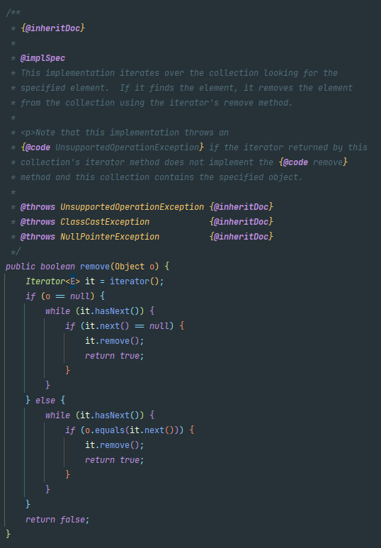
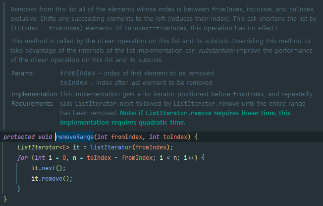

## 상속을 고려해 설계하고 문서화해라. 그러지 않았다면 상속을 금지하라

### 🔥 상속용 클래스는 **재정의 가능한 메서드**들을 내부적으로 어떻게 이용하는지, 어떤 순서로 호출하는지 **문서**로 남겨야 한다.

**메서드 설명**

- `Implementation Requirements` 는 메서드 내부 동작 방식을 설명
- `@implSpec`태그를 붙여주면 자바독 도구가 생성(자바 8부터 도입)

**예시** - `AbstractCollection`

- `public`으로 노출되어 있으며 `상속`이 가능하다.
- `implSpec`으로 동작방식을 설명한다.
  :`remove`를 구현하지 않으면 예외가 발생하며, `iterator` 메서드를 사용하고 있음을 명시




### 🔥상속용 클래스의 생성자는 재정의 가능한 메서드를 호출해서는 안 된다.

- 상위 클래스의 생성자가 하위 클래스의 생성자보다 먼저 실행되어 오동작하게 된다.

**예시**

- `instant`출력이 두 번 일어난다고 생각되지만, 첫 번째는 `null`이 출력된다.

```java
public class Super {
    public Super() {
        overrideMe();
    }

    public void overrideMe() {}
}

public final class Sub extends Super {
    private final Instant instant;
    
    Sub() {
        instant = Instant.now();
    }

    @Override
    public void overrideMe() {
        System.out.println(instant);
    }

    public static void main(String[] args) {
        Sub sub = new Sub();
        sub.overrideMe();
    }
}

// 출력 결과
// null
// 2025-05-14T07:05:16.949775900Z
```


### 🔥 상속 클래스 설계 시 훅(hook)을 잘 선별하여 공개하자

- 하위 클래스에서 `clear`메서드를 호출하면 내부적으로 `removeRange`가 호출된다.
  : 하위 클래스에서는 `removeRange`를 상황에 맞게 구현함으로써 성능을 확보할 수 있다.
- 선별의 기준은 없으며, 직접 하위 클래스를 `3개` 정도 만들어서 시험 및 검증해야 한다.




### ❓ Cloneable과 Serializable 인터페이스를 조심해라

위 인터페이스를 구현한 클래스를 상속 가능하게 설계하는 것은 일반적으로 좋지 않다.
`Cloneable`의 `clone()`과 `Serializable`의 `readObject()`는 새로운 객체를 만들어내는, 생성자와 비슷한 기능을 가졌다.
클래스의 상태가 초기화되기 전에 메서드부터 호출되는 상황이 올 수 있다.

`Serializable`을 구현한 상속용 클래스가 `readResolve()`, `writeReplace()` 메서드를 가질 때 protected로 선언해야 한다.
private으로 선언 시 하위 클래스에서는 무시된다.


### 🔥상속을 금지하는 방법

1. 클래스를 final로 선언
2. 모든 생성자를 private나 default로 선언 뒤 public 정적 팩토리 생성

일반적인 구체 클래스가 상속을 금지하는건 사용이 불편해질 수 있다.
이를 해결하기 위해서는 클래스 내부에서 재정의 가능 메서드를 사용하지 않게 만들고 이를 문서화한다.
그렇게 되면 메서드를 재정의해도 다른 메서드의 동작에 아무런 영향을 주지 않는다.


### 🔥 상속에서 도우미 메서드 활용하기

클래스 동작을 유지하며 재정의 가능 메서드를 사용하는 코드를 제거하고 싶다면,
재정의 가능 메서드를 private으로 변경한다.

```java
public class SuperClazz {
    public SuperClazz() {}

    public void sampleMethod() {
        helper();
    }

    private void helper() {
        System.out.println("동작 유지");
    }
}

public class SubClazz extends SuperClazz{
    private String value;

    public SubClazz() {
        value = "override";
    }

    @Override
    public void sampleMethod() {
        System.out.println(value);
    }
}
```

