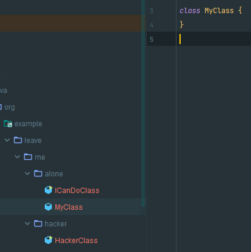
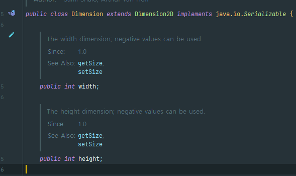

# public 클래스에서는 public 필드가 아닌 접근자 메서드를 사용하라

**✅ 목적없는 클래스는 `public`이어서는 안 된다!**

```java
public class Point {
    public double x;
    public double y;

    @Override
    public String toString() {
        return "Point{" +
                "x=" + x +
                ", y=" + y +
                '}';
    }
}
```

```java
public static void main(String[] args) {
        Point point = new Point();
        point.x = 3;
        point.y = 5;
        System.out.println("point = " + point);
        point.y = 119;
        System.out.println("point = " + point);
    }
```

문제점

1. 내부 표현을 바꿀 수 없다.
2. 불변식을 보장하지 못 한다.
3. 외부에서 필드에 접근할 때 부수 작업을 수행할 수 없다.

**✅ 접근자와 변경자 메서드를 활용하여 데이터를 캡슐화한다.**

```java
public class Point {
    public double x;
    public double y;

    public double getX() {
        return x;
    }

    public void setX(final double x) {
        this.x = x;
    }

    public double getY() {
        return y;
    }

    public void setY(final double y) {
        this.y = y;
    }
}
```

- 접근자를 제공하면 1번과 3번에 대한 부분을 해결할 수 있다.
  - 내부의 필드를 자유롭게 변경할 수 있다.
  - 메서드 내부에 부수적인 작업을 처리할 수 있다.

```java
public class Point {
    public double height;
    public double width;

    public double getX() {
        return height;
    }

    public void setX(final double x) {
        if (x < 0) throw new IllegalArgumentException("");
        this.height = x;
    }

    public double getY() {
        return width;
    }

    public void setY(final double y) {
        if (y < 0) throw new IllegalArgumentException("");
        this.width = y;
    }
}
```

**✅ package-private 클래스 혹은 private 중첩 클래스라면 데이터 필드를 노출해도 괜찮다**

> `package-private 클래스`란?
>
> - 클래스나 필드, 메서드 앞에 아무 접근 제어자가 없으면 기본적으로 `package-private`상태이다. 즉, 같은 패키지 내에서 접근이 가능하지만, 다른 패키지에서는 접근할 수 없다.
>   → `ICanDoClass`는 `MyClass`를 접근할 수 있지만, `HackerClass`는 `MyClass`에 접근이 불가능하다.
>
> 
>
> `private 중첩 클래스`란?
>
> - 외부 클래스 내부에 `private`접근 제어자로 정의된 클래스이며, 외부 클래스 내부에서만 사용된다.
>   ```java
>   class OuterClass {
>       private class InnerClass {
>           int value;
>   
>           InnerClass(int value) {
>               this.value = value;
>           }
>   
>           public void printValue() {
>               System.out.println("Value: " + value);
>           }
>       }
>   
>       public void createInnerClass(int value) {
>           InnerClass inner = new InnerClass(value);
>           inner.printValue();  // OuterClass 내에서 InnerClass의 value에 접근 가능
>       }
>   }
>   ```

- **외부의 접근을 제한**하기 때문에 필드를 노출해도 문제 없이 사용될 수 있다는 의미이다.

**💥자바 플랫폼 라이브러리의 `Point`와 `Dimension`은 필드를 그대로 노출하는 안 좋은 사례이다.**

- `Dimension`코드
  

  ```java
  public static void main(String[] args) {
          Dimension dimension = new Dimension();
          System.out.println("dimension = " + dimension);
          dimension.height = 3000;
          System.out.println("dimension = " + dimension);
      }
  
  dimension = java.awt.Dimension[width=0,height=0]
  dimension = java.awt.Dimension[width=0,height=3000]
  ```

**✅ 불편 필드를 노출한 public 클래스**

- 불변식을 보장하지만 표현 방식을 읽을 수 없고, 필드를 읽을 때 부수 작업을 수행할 수 없다.

```java
public class Time {
    public final int hour;
    public final int minute;

    public Time(final int hour, final int minute) {
        this.hour = hour;
        this.minute = minute;
    }
}
```


## 요약

- `public`클래에서는 `public`필드 대시 접근자 메서드를 사용하자. 내부 표현식 변경이 자유롭고, 부수 작업 효과도 누릴 수 있다.