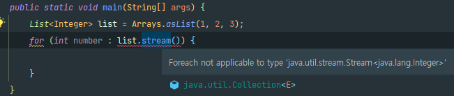
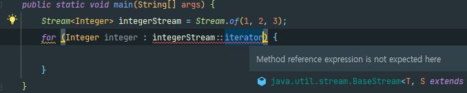

# 반환 타입으로는 스트림보다 컬렉션이 낫다

### 전통적인 방법

일련의 원소를 반환할 때 `Collection`, `Set`, `List` 같은 컬렉션 인터페이스, `Iterable`이나 배열을 사용하였다.

```java
public interface Collection<E> extends Iterable<E> {
    //...
}
```

`Java 7`이하 버전까지는 타입 선택에 문제가 없었지만 `Java 8`부터 등장한 `Stream`으로 상당히 복잡해졌다.

### Iterable vs Stream

`Stream`은 반복을 지원하지 않는다.



`for-each`문에 들어간 `numbers.stream()`에서 컴파일 에러가 난다. `for-each`는 `List`, `Set`과 같은 `Iterable`구현체에 대해서만 사용이 가능하다. `for-each` 루프를 사용하고 싶은 사용자는 `Stream`이 반환되면 불만을 가질 수밖에 없다.

### Stream을 Iterable로 변환해보기

`Stream`인터페이스는 `Iterable` 인터페이스가 정의한 추상 메서드를 모두 포함할 뿐만 아닐 `Iterable`이 정의한 방식대로 동작한다. 그럼에도 `Stream`에서 `foreach`를 지원하지 않는 이유는 `Iterable`을 확장하지 않아서이다. 얼핏보면 `Stream`의 `Iterator`메서드 참조를 사용하면 해결가능 할 듯하다.



적절한 형변환이 필요하다. 그렇지만 실전에 쓰기에는 너무 난잡하고 직관성이 떨어진다.

```java
 public static void main(String[] args) {
        Stream<Integer> integerStream = Stream.of(1, 2, 3);
        for (Integer integer : (Iterable<? extends Integer>) integerStream::iterator) {
            System.out.println("integer = " + integer);
        }
    }
```

이를 보완하기 위해 어뎁터 메서드를 제공할 수 있다.

```java
public static void main(String[] args) {
        Stream<Integer> integerStream = Stream.of(1, 2, 3);
        for (Integer integer : getIterable(integerStream)) {
            System.out.println("integer = " + integer);
        }
    }
    
    private static <T> Iterable<T> getIterable(Stream<T> stream) {
        return stream::iterator;
    }
```

### Iterable을 Stream으로 변환해보기

반대로 `Iterable`을 반환하는 API만 있다면 `Stream`을 사용하고 싶은 사용자 입장에서는 불만이 있을 것이다. 이를 위한 어뎁터 메서드 구현도 가능하다.

```java
public static void main(String[] args) {
        List<Integer> list = Arrays.asList(1, 2, 3);
        Stream<Integer> integerStream = streamOf(list);
        integerStream.forEach(integer -> System.out.println("integer = " + integer));
    }
    
    private static <E> Stream<E> streamOf(Iterable<E> iterable) {
        return StreamSupport.stream(iterable.spliterator(), false);
    }
```

### 결론은 Collection을 반환하자

어뎁터 메서드는 클라이언트 코드를 어수선하게 만들고 2, 3배 가량 성능이 좋지 못하다.

만약 객체 시퀀스를 반환하는데 해당 메서드가 무조건 `Stream`으로만 사용이 된다면 `Stream`을 반환해도 무방하다. 반대로 무조건 `Iterable`로만, 즉, 반복문에서만 사용된다면 `Iterable`로 반환해도 무방하다.

하지만 공개 API를 작성할 때는 `Stream`을 원하는 사용자와 `Iterable`을 원하는 사용자 모두를 배려해야한다.

여기서 `List`, `Set` 등의 상위 타입인 `Collection`을 보면 `Iterable`의 하위 타입이면서 `Stream`을 반환하는 `stream` 메서드도 제공한다.

```java
public interface Collection<E> extends Iterable<E> {
    // ...
    default Stream<E> stream() {
        return StreamSupport.stream(spliterator(), false);
    }
    // ...
}
```

때문에 공개 API의 반환 타입으로는 `Collection`의 하위 타입을 사용한다면 `Iterable`과 `Stream`을 원하는 사용자를 만족시킬 수 있다.

### 반환하는 컬렉션이 너무 크다면 전용 컬렉션도 고려하자❓❓❓ㄴ

단지 컬렉션을 반환한다는 이유로 덩치 큰 시퀀스를 메모리에 올려서는 안 된다.

```java
public class PowerSet {
    public static final <E> Collection<Set<E>> of(Set<E> s) {
        List<E> src = new ArrayList<>(s);
        if (src.size() > 30)
            throw new IllegalArgumentException(
                "집합에 원소가 너무 많습니다(최대 30개).: " + s);
        return new AbstractList<Set<E>>() {
            @Override public int size() {
                // 멱집합의 크기는 2를 원래 집합의 원소 수만큼 거듭제곱 것과 같다.
                return 1 << src.size();
            }

            @Override public boolean contains(Object o) {
                return o instanceof Set && src.containsAll((Set)o);
            }

            @Override public Set<E> get(int index) {
                Set<E> result = new HashSet<>();
                for (int i = 0; index != 0; i++, index >>= 1)
                    if ((index & 1) == 1)
                        result.add(src.get(i));
                return result;
            }
        };
    }
}
```

위 예시는 멱집합을 전용 컬렉션으로 직접 구현한 것이다. 멱집합이란 한 집합의 모든 부분집합을 의미한다. 원소 개수가 `n`이라면 2^n이 멱집합의 원소 개수이다.

> 예를 들어, 집합 `{a, b, c}`의 멱집합은 `{ {}, {a}, {b}, {c}, {a, b}, {a, c}, {b, c}, {a, b, c} }`

이를 메모리에 오리면 너무 많은 메모리가 소모된다. 때문에 멱집합을 구현하는 전용 컬렉션을 직접 구현하여 사용할 수 있다. 위 예시는 원소의 인덱스를 비트 벡터로 사용하므로 메모리 공간을 효율적으로 사용할 수 있다.

### 정리

1. `Iterable`과 `Stream`은 어뎁터 메서드를 통해서 서로 변환이 가능하다.
2. 단, 어뎁터 메서드는 클라이언트 메서드를 어수선하게 만들며 성능 또한 좋지 못하다.
3. 만약 반환값이 `Stream`만 쓴다고 보장된다면 `Stream`을 반환해도 무방하다. 반대로 `Iterable`의 경우도 마찬가지이다.
4. 사용자를 생각하여 반환값은 가능하면 `Iterable`의 하위타입이면서 `stream`을 지원하는 `Collection`의 하위타입을 반환하자.