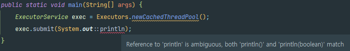
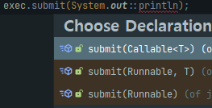

# 표준 함수형 인터페이스를 사용하라

- 함수형 인터페이스는 직접 구현하지 말고 표준으로 정의된 것을 활용하자

  - API가 다루는 개념의 수를 줄여 익히기 쉽다.
  - 표준 함수형 인터페이스들은 유용한 디폴트 메서드를 많이 제공한다.

  > `java.util.function`패키지에는 총 43개의 표준형 인터페이스가 존재한다.

---

### ✅ 표준 함수형 인터페이스 예시

| 인터페이스        | 함수 시그니처       | 예                  |
| ----------------- | ------------------- | ------------------- |
| UnaryOperator<T>  | T apply(T t)        | String::toLowerCase |
| BinaryOperator<T> | T apply(T t1, T t2) | BigInteger::add     |
| Predicate<T>      | boolean test(T t)   | Collection::isEmpty |
| Function<T,R>     | R apply(T t)        | Arrays::asList      |
| Supplier<T>       | T get()             | Instant::now        |
| Consumer<T>       | void accept(T t)    | System.out::println |

1. `UnaryOperator<T>`
   : 하나의 입력을 받아서 동일한 타입의 출력을 반환하는 연산

   ```java
   // UnaryOperator로 String::toLowerCase 메서드 참조
   UnaryOperator<String> toLowerCase = String::toLowerCase;
   
   String input = "HELLO WORLD";
   String result = toLowerCase.apply(input);  // "hello world"
   
   System.out.println(result);  // 출력: hello world
   ```

2. `BinaryOperator<T>`
   : 두 개의 동일한 타입의 인수를 받아서 하나의 결과를 반환하는 연산

   ```java
   BinaryOperator<BigInteger> adder = BigInteger::add;
   BigInteger a = new BigInteger("111111111111111111111111111");
   BigInteger b = new BigInteger("222222222222222222222222222");
   
   BigInteger result = adder.apply(a, b);
   
   System.out.println(result); // 출력: 333333333333333333333333
   ```

3. `Predicate<T>`
   : 주어진 인수에 대해 `true` 또는 `false`를 반환

   ```java
   Predicate<Collection<?>> isEmpty = Collection::isEmpty;
   
   Collection<String> list = new ArrayList<>();
   boolean result = isEmpty.test(list);  // 리스트가 비었는지 검사
   
   System.out.println(result);  // 출력: true
   ```

4. `Function<T, R>`
   : 하나의 입력값을 받아서 다른 타입의 결과를 반환하는 연산

   ```java
   Function<int[], List<Integer>> asList = arr -> Arrays.stream(arr).boxed().toList();
   
   int[] array = {1, 2, 3, 4};
   List<Integer> result = asList.apply(array);  // int 배열을 List로 변환
   
   System.out.println(result);  // 출력: [1, 2, 3, 4]
   ```

5. `Supplier<T>`
   : 입력값 없이 결과를 반환

   ```java
   Supplier<Instant> nowSupplier = Instant::now;
   
   Instant currentInstant = nowSupplier.get();  // 현재 시간 반환
   
   System.out.println(currentInstant);  // 출력: 현재 시간 (예: 2025-06-11T12:34:56.789Z)
   ```

6. `Consumer<T>`
   : 하나의 입력값을 받아서 처리를 수행하는 연산이며, 반환값은 없음

   ```java
   Consumer<String> printer = System.out::println;
   
   String message = "Hello, World!";
   printer.accept(message);  // 콘솔에 출력
   ```

- 그 외의 함수형 인터페이스에 대한 유추가 가능하다.
  - `int`, `long`, `double`용으로 `IntPredicate`, `LongBinaryOperator` 등등 확장이 되어 있다.
  - 인수를 2개씩 받을 경우 `Bi`를 접두사로 붙여 준다. `BiPredicate<T,U>`, `BiFunction<T,U,R>` 등등

- **결론, 실무에서 자주 쓰이는 표준 함수형 인터페이스를 주로 활용하자!!**

---

### ✅ 전용 함수형 인터페이스 구현은 신중해야한다.

- 필수 조건 3가지 중 하나 이상을 만족해야한다.

  1. 자주 쓰이며, 이름 자체가 용도를 명확히 설명해준다.

  2. 반드시 따라야 하는 규약이 있다.
     : `BinaryOperator`는 2개의 인자를 받아야하는 규약이 있다.

  3. 유용한 디폴트 메서드를 제공할 수 있다.
     : `Predicate<T>`의 `and`또는 `or`메서드는 여러 개의 조건을 결합할 수 있다.

     ```java
     // 기본 Predicate를 정의
     Predicate<String> isEmpty = String::isEmpty;
     Predicate<String> isNotEmpty = isEmpty.negate();  // isNotEmpty는 isEmpty의 반대 조건
     
     Predicate<String> startsWithA = s -> s.startsWith("A");
     
     // and 메서드를 사용하여 두 조건을 모두 만족하는지 확인
     Predicate<String> startsWithAAndIsNotEmpty = startsWithA.and(isNotEmpty);
     ```

---

### ✅ `@FunctionalInterface`를 사용하자

- 프로그래머의 의도를 명시하는 것으로 `@Override`를 사용하는 이유와 비슷하다.
  1. 설명 문서를 읽을 사람에게 그 인터페이스가 람다용으로 설계된 것임을 알려준다.
  2. 해당 인터페이스가 추상 메서드를 오직 하나만 가지도록 컴파일되게 해준다.
  3. 유지보수 과정에서 누군가 실수로 메서드를 추가하지 못하게 막아준다.

---

### ✅ 서로 다른 함수형 인터페이스를 같은 위치의 인수로 받는 메서들을 다중 정의해서는 안 된다.

- 다중 정의 해소 알고리즘이 해결할 수 없는 문제로 컴파일 에러가 발생한다.
  - `Runnnable`로 형변환을 하는 식으로 해결할 수 있지만, 클라이언트에게 모호함을 줄 뿐이다.



